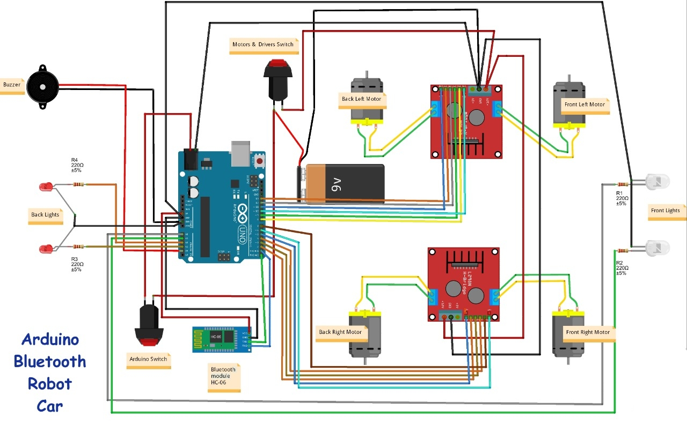

# RC-car_arduino
Hi everyone! This is a remote cum smartphone-controlled Arduino 4WD robot car or Bluetooth Arduino robot. It can move forward and backward, left and right, change its speed, turn on / off front and back lights and also it can horn.  This is a quite simple design robot you can easily build it.

# Prerequisite
1)Arduino Uno R3 Board
2)DC Motor and Wheel x4
3)Motor Driver L298N x2
4)Bluetooth module HC-06
5)Li-ion battery 18650 x2
6)LEDs + resistors 220 Ohm x4
7)Buzzer

# Wiring Diagram

# Smartphone Controller app
<a herf = "https://play.google.com/store/apps/details?id=braulio.calle.bluetoothRCcontroller&hl=en_IN&gl=US">Link for the controller app</a>

# Final car built 

# Video demonstration

<video src="https://user-images.githubusercontent.com/67566884/197759642-87e7ee03-af0f-4765-83eb-e76519098c62.mp4"></video>
<video src="https://user-images.githubusercontent.com/67566884/197759622-069f71f9-31b5-4d96-8f77-67e703704648.mp4"></video>

